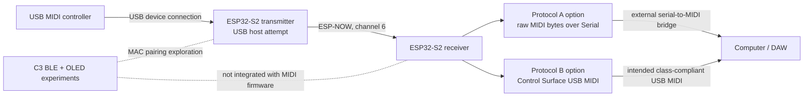

# Architecture

## Intended system

The arrows describe the intended data flow. The recovered source does not
establish successful end-to-end operation.

## Transmitter responsibilities

The S2 transmitter candidates initialize the ESP-IDF USB Host library, register
an asynchronous client, accept USB host events, attempt to identify a
MIDIStreaming interface and bulk/interrupt IN endpoint, submit 64-byte input
transfers, and decode four-byte USB-MIDI event packets. They then place status
and data bytes in an ESP-NOW struct.

`DEVICE_ESP2.0` contains more diagnostics and reconnection instrumentation but
does not connect its descriptor checker to the new-device event. `DEVICE_ESP3.0`
uses the reported device address and parses the active descriptor, but does not
claim the discovered interface before submitting transfers. Neither is a
production USB host implementation.

## Wireless responsibilities

The two main pairs use Wi-Fi station mode and channel 6. A receiver broadcasts
an announcement, the transmitter responds, both store peer MACs in Preferences
(NVS), and periodic heartbeats drive paired/reconnecting states. There is no
session identifier or packet sequence number. MIDI delivery is best effort.

The C3 branch explored BLE discovery and MAC exchange on channel 1. It is a
separate protocol and is not integrated with either MIDI payload.

## Receiver responsibilities

`HOST_ESP2.0` writes raw MIDI bytes to `Serial` and therefore requires external
bridge software. USB CDC serial is not USB MIDI.

`HOSTESP3.0` instantiates Control Surface's `USBMIDI_Interface` and maps channel
voice messages into its API. This is the only recovered source that attempts a
class-compliant computer-facing MIDI interface. Cached binaries and a clean
compile demonstrate buildability; no host enumeration capture demonstrates
runtime enumeration.

## Boundaries not implemented

- No HID descriptors, HID report parsing, or HID transport were recovered.
- No common versioned transport module is shared between firmware images.
- No schematic or verified power-path design was supplied.
- OLED/BLE UI code exists only in the C3 experiment branch.
- There is no automated hardware-in-the-loop test or recorded DAW test.
